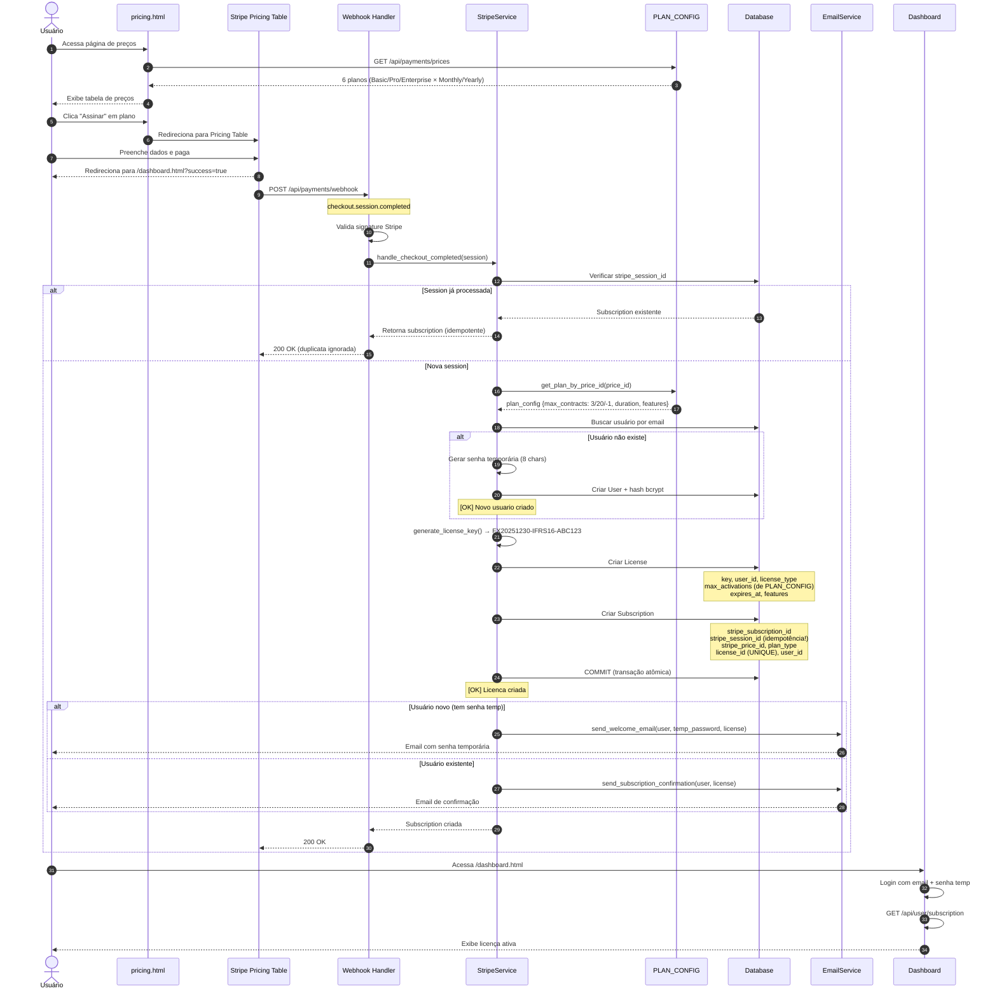
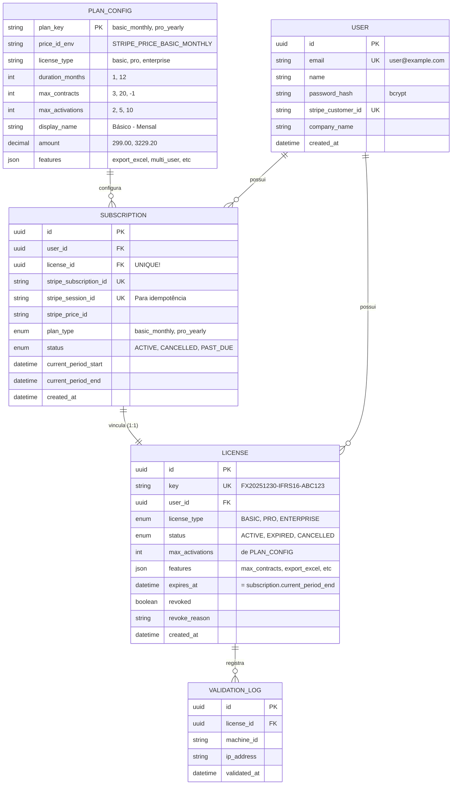
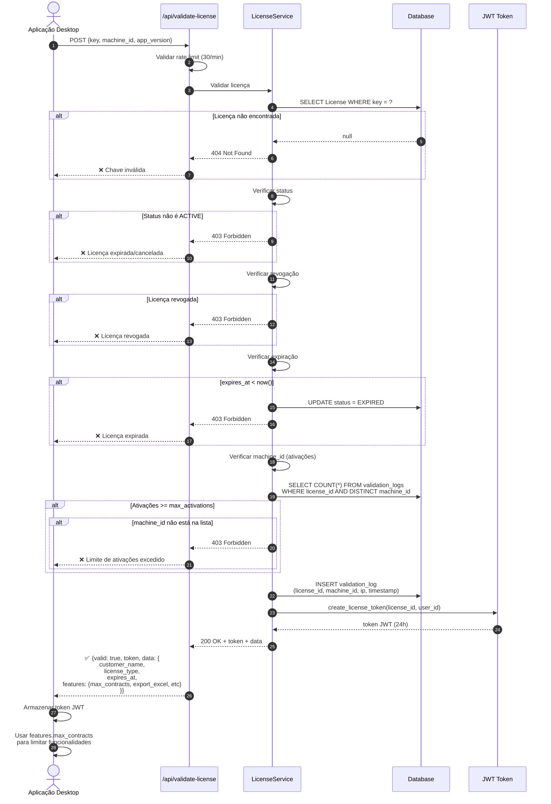
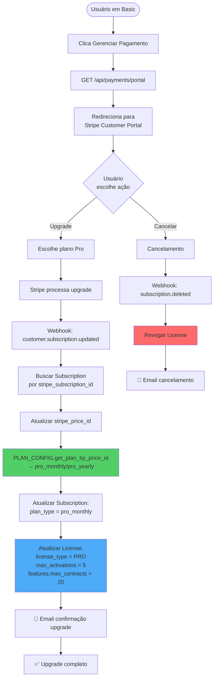
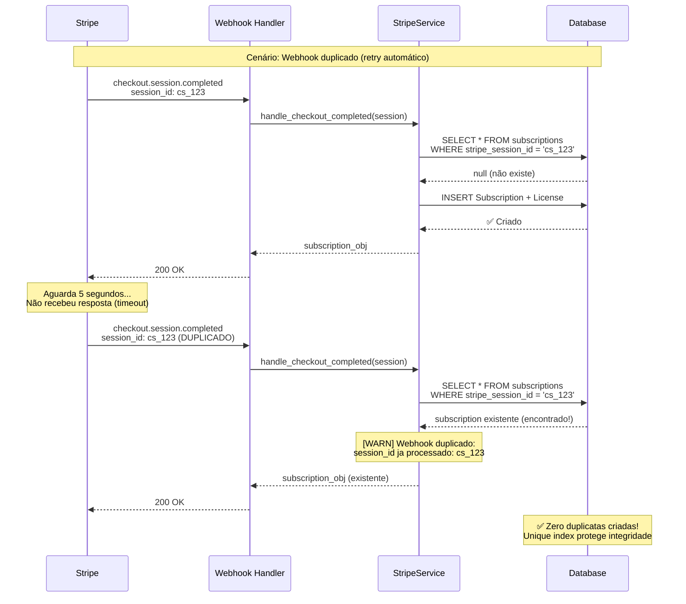
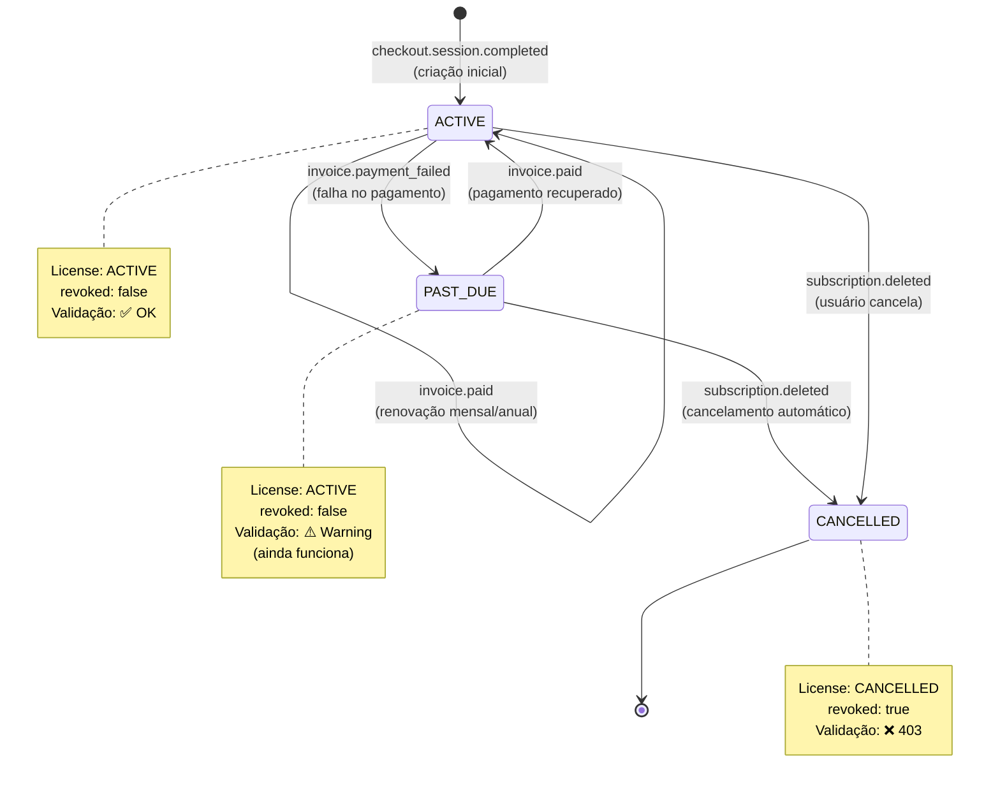
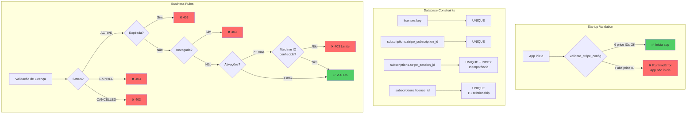

# Fluxo de Assinatura IFRS 16 - Consolidado

## 🎯 Visão Geral

Este documento apresenta o fluxo completo de assinatura após a consolidação, mostrando desde a escolha do plano até a validação da licença.

---

## 📊 Fluxo Principal - Checkout e Ativação



---

## 🔄 Fluxo de Webhooks - Ciclo de Vida

```mermaid
graph TB
    Start([Stripe envia webhook]) --> Validate{Validar<br/>signature}
    Validate -->|Inválida| Reject[❌ 400 Bad Request]
    Validate -->|Válida| CheckEvent{Tipo de<br/>evento?}

    %% checkout.session.completed
    CheckEvent -->|checkout.session.<br/>completed| CheckSession{Session ID<br/>já existe?}
    CheckSession -->|Sim| Idempotent[⚠️ Idempotência:<br/>Retornar existente]
    CheckSession -->|Não| GetConfig[Obter PLAN_CONFIG<br/>por price_id]
    GetConfig --> CreateUser{Usuário<br/>existe?}
    CreateUser -->|Não| NewUser[Criar User +<br/>senha temp]
    CreateUser -->|Sim| ExistingUser[Usar existente]
    NewUser --> CreateLicense
    ExistingUser --> CreateLicense[Criar License +<br/>Subscription]
    CreateLicense --> CommitDB[(Commit atômico)]
    CommitDB --> SendEmail[📧 Enviar email]
    SendEmail --> Success1[✅ 200 OK]
    Idempotent --> Success1

    %% invoice.paid
    CheckEvent -->|invoice.paid| FindSub1[Buscar Subscription<br/>por stripe_id]
    FindSub1 --> UpdatePeriod[Atualizar<br/>current_period_end]
    UpdatePeriod --> RenewLicense[Renovar License<br/>expires_at]
    RenewLicense --> Success2[✅ 200 OK<br/>[OK] Subscription renovada]

    %% invoice.payment_failed
    CheckEvent -->|invoice.payment_<br/>failed| FindSub2[Buscar Subscription]
    FindSub2 --> MarkPastDue[Marcar status:<br/>PAST_DUE]
    MarkPastDue --> Success3[✅ 200 OK<br/>[WARN] Pagamento falhou]

    %% customer.subscription.deleted
    CheckEvent -->|customer.subscription.<br/>deleted| FindSub3[Buscar Subscription]
    FindSub3 --> CancelSub[Status: CANCELLED]
    CancelSub --> RevokeLicense[Revogar License<br/>revoked=true<br/>status=CANCELLED]
    RevokeLicense --> Success4[✅ 200 OK<br/>[CANCEL] Subscription cancelada]

    %% Evento desconhecido
    CheckEvent -->|Outro| Ignore[ℹ️ 200 OK<br/>Evento ignorado]

    style CheckSession fill:#ffd43b
    style Idempotent fill:#51cf66
    style CreateLicense fill:#4dabf7
    style CommitDB fill:#ff6b6b
    style RevokeLicense fill:#ff6b6b
```

---

## 🗄️ Fluxo de Dados - Arquitetura



---

## 🔐 Fluxo de Validação de Licença



---

## 🔄 Fluxo de Upgrade de Plano



---

## 📋 Fonte Única de Verdade - PLAN_CONFIG

```mermaid
graph LR
    subgraph "PLAN_CONFIG (config.py)"
        Basic[basic_monthly<br/>3 contratos, 2 ativações<br/>R$ 299/mês]
        BasicY[basic_yearly<br/>3 contratos, 2 ativações<br/>R$ 3.229,20/ano]
        Pro[pro_monthly<br/>20 contratos, 5 ativações<br/>R$ 499/mês]
        ProY[pro_yearly<br/>20 contratos, 5 ativações<br/>R$ 5.389,20/ano]
        Ent[enterprise_monthly<br/>ilimitado, 10 ativações<br/>R$ 999/mês]
        EntY[enterprise_yearly<br/>ilimitado, 10 ativações<br/>R$ 10.789,20/ano]
    end

    subgraph "Consumers"
        Webhook[StripeService<br/>handle_checkout_completed]
        Prices[/api/payments/prices]
        Frontend[pricing.html]
        Renewal[handle_invoice_paid]
    end

    Basic --> Webhook
    BasicY --> Webhook
    Pro --> Webhook
    ProY --> Webhook
    Ent --> Webhook
    EntY --> Webhook

    Basic --> Prices
    BasicY --> Prices
    Pro --> Prices
    ProY --> Prices
    Ent --> Prices
    EntY --> Prices

    Prices --> Frontend

    Basic --> Renewal
    Pro --> Renewal
    Ent --> Renewal

    style Basic fill:#51cf66
    style Pro fill:#4dabf7
    style Ent fill:#ff6b6b
```

---

## 🛡️ Idempotência de Webhooks



---

## 📊 Estados da Subscription



---

## ✅ Validações e Constraints



---

## 🎯 Resumo dos Endpoints

### Públicos (sem autenticação)
- `POST /api/validate-license` - Valida chave de licença, retorna JWT
- `GET /api/payments/prices` - Lista planos disponíveis (usa PLAN_CONFIG)
- `POST /api/payments/webhook` - Recebe webhooks do Stripe

### Autenticados (requer JWT)
- `GET /api/payments/portal` - Redireciona para Customer Portal
- `GET /api/user/subscription` - Retorna subscription do usuário logado
- `POST /api/check-license` - Verifica status com token JWT

---

## 📈 Métricas de Sucesso

### Consolidação ✅
- ✅ 1 router de pagamentos (payments.py)
- ✅ PLAN_CONFIG como fonte única de verdade
- ✅ Zero código duplicado

### Consistência ✅
- ✅ Limites: 3/20/ilimitado em todo o sistema
- ✅ 6 price IDs validados no startup
- ✅ Idempotência via stripe_session_id

### Qualidade ✅
- ✅ 7/7 testes E2E passando (100%)
- ✅ 165/194 testes unitários (85%)
- ✅ Documentação completa

---

**Criado em:** 2025-12-30
**Versão:** 1.0
**Status:** ✅ Consolidação Completa
