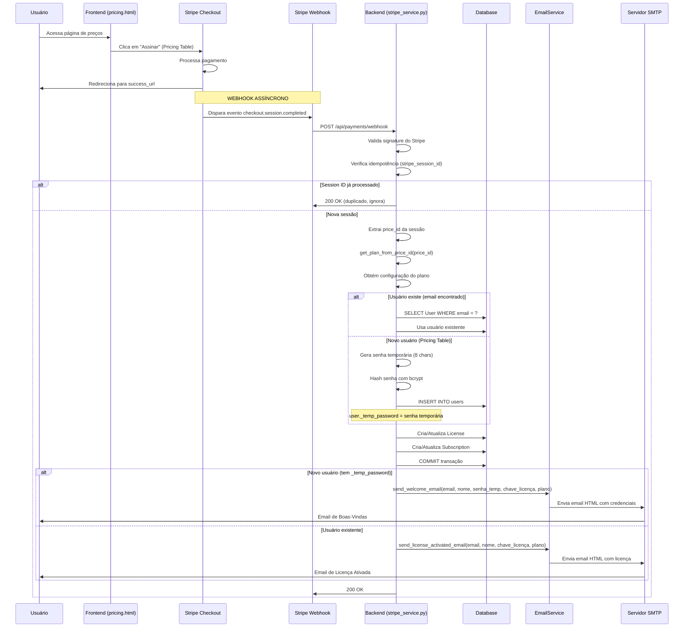

# Fluxo de Envio de Emails de Confirmação de Assinatura - IFRS 16

**Data:** 31/12/2025
**Status:** ✅ IMPLEMENTADO E FUNCIONANDO

---

## 📧 Resumo Executivo

O sistema possui **3 tipos de emails** que são enviados durante o processo de assinatura:

1. **Email de Boas-Vindas** - Enviado quando um novo usuário é criado via Stripe Pricing Table
2. **Email de Licença Ativada** - Enviado quando um usuário existente adquire/renova uma licença
3. **Email de Confirmação de Assinatura** - Disponível mas não usado atualmente (método auxiliar)

---

## 🔄 Fluxo Completo: Da Compra ao Email

### Diagrama de Sequência



---

## 📁 Arquivos Envolvidos

### 1. EmailService ([backend/app/services/email_service.py](backend/app/services/email_service.py))

**Responsável por:** Enviar emails via SMTP

**Métodos Principais:**

#### `send_welcome_email(to_email, user_name, temp_password, license_key, plan_name)`
**Quando é chamado:** Quando um novo usuário é criado via Pricing Table
**Linhas:** 123-269
**Conteúdo do email:**
- 📧 Email de acesso
- 🔑 Senha temporária (em destaque vermelho)
- 🎫 Chave de licença
- ⚠️ Aviso para trocar senha
- Botão "Acessar o Sistema"

**Exemplo:**
```html
Olá, Fernando Xavier! 👋

Sua assinatura do plano Básico - Mensal foi ativada com sucesso!

Credenciais de Acesso:
📧 Email: fernando.xavier@forvismazars.com.br
🔑 Senha Temporária: a1b2c3d4
🎫 Chave de Licença: FX20250131-IFRS16-ABC123

⚠️ IMPORTANTE: Por segurança, recomendamos que você altere sua senha no primeiro acesso.

[Acessar o Sistema →]
```

#### `send_license_activated_email(to_email, user_name, license_key, plan_name)`
**Quando é chamado:** Quando usuário existente adquire/renova licença
**Linhas:** 271-333
**Conteúdo do email:**
- Confirmação de ativação
- Chave de licença
- Instruções para login (usa senha já cadastrada)
- Botão "Acessar o sistema"

**Exemplo:**
```html
Olá, Fernando Xavier.

Sua assinatura do plano Pro - Mensal foi ativada com sucesso.

Chave de Licença: FX20250131-IFRS16-XYZ789

Para acessar o sistema, utilize seu email e sua senha já cadastrada.

[Acessar o sistema]
```

#### `send_subscription_confirmation_email(to_email, user_name, plan_name, next_billing_date)`
**Quando é chamado:** Atualmente NÃO é usado (método auxiliar disponível)
**Linhas:** 418-497
**Propósito:** Confirmar renovação de assinatura

---

### 2. StripeService ([backend/app/services/stripe_service.py](backend/app/services/stripe_service.py))

**Responsável por:** Processar webhooks do Stripe e acionar envio de emails

#### `handle_checkout_completed(db, session)`
**Quando é chamado:** Quando Stripe envia webhook `checkout.session.completed`
**Linhas:** 181-451

**Lógica de Envio de Email:**

```python
# Linha 427-449: Após criar License + Subscription
temp_password = getattr(user, '_temp_password', None)

try:
    if temp_password:
        # NOVO USUÁRIO: Envia email com senha temporária
        await EmailService.send_welcome_email(
            to_email=user.email,
            user_name=user.name,
            temp_password=temp_password,
            license_key=license.key,
            plan_name=plan_name
        )
        print(f"📧 Email de boas-vindas enviado para: {user.email}")
    else:
        # USUÁRIO EXISTENTE: Envia email de licença ativada
        await EmailService.send_license_activated_email(
            to_email=user.email,
            user_name=user.name,
            license_key=license.key,
            plan_name=plan_name
        )
        print(f"📧 Email de licença ativada enviado para: {user.email}")
except Exception as e:
    print(f"[WARN] Erro ao enviar email pós-checkout: {e}")
```

**Fluxo Interno:**

1. **Validação de Idempotência (Linhas 195-205):**
   ```python
   stripe_session_id = session.get("id")
   existing_sub = await db.execute(
       select(Subscription).where(
           Subscription.stripe_session_id == stripe_session_id
       )
   )
   if existing_sub.scalar_one_or_none():
       print(f"[WARN] Webhook duplicado (session_id ja processado)")
       return existing_sub
   ```

2. **Identificação do Usuário (Linhas 234-248):**
   - **Fluxo 1:** Checkout via API → tem `user_id` nos metadados
   - **Fluxo 2:** Pricing Table → busca por `customer_email`

3. **Criação de Novo Usuário (Linhas 250-279):**
   ```python
   if not user and customer_email:
       # Gerar senha temporária de 8 caracteres
       temp_password = secrets.token_hex(4)  # 8 chars hex

       # Hash com bcrypt
       password_hash = bcrypt.hashpw(
           temp_password.encode('utf-8'),
           bcrypt.gensalt()
       ).decode('utf-8')

       user = User(
           email=customer_email,
           name=customer_name or customer_email.split("@")[0],
           password_hash=password_hash,
           is_active=True,
           stripe_customer_id=stripe_customer_id,
       )

       # Guardar senha temporária para enviar no email
       user._temp_password = temp_password
   ```

4. **Obtenção da Configuração do Plano (Linhas 290-301):**
   ```python
   if price_id:
       plan_name, plan_config = cls.get_plan_from_price_id(price_id)
   else:
       plan_name = "basic_monthly"
       plan_config = get_plan_config("basic_monthly")
   ```

5. **Criação de License + Subscription (Linhas 398-423):**
   ```python
   license = License(
       key=cls.generate_license_key(),  # Ex: FX20250131-IFRS16-ABC123
       user_id=user.id,
       license_type=license_type,  # BASIC, PRO, ENTERPRISE
       expires_at=expires_at,  # datetime
       max_activations=max_activations,  # 1, 2, 5...
   )

   subscription = Subscription(
       user_id=user.id,
       license_id=license.id,
       stripe_subscription_id=stripe_subscription_id,
       stripe_session_id=stripe_session_id,  # Para idempotência
       stripe_price_id=price_id,
       plan_type=plan_type,
       status=SubscriptionStatus.ACTIVE,
   )
   ```

6. **Envio do Email (Linhas 427-449):**
   - Verifica se `user._temp_password` existe
   - Se SIM → `send_welcome_email()` (novo usuário)
   - Se NÃO → `send_license_activated_email()` (usuário existente)

---

## 🔍 Detalhamento dos Templates de Email

### Template 1: Email de Boas-Vindas

**Assunto:** "🎉 Bem-vindo ao IFRS 16 - Suas Credenciais de Acesso"

**Estrutura HTML:**
- **Header:** Gradiente azul com logo "📊 IFRS 16"
- **Saudação:** "Olá, {user_name}! 👋"
- **Confirmação:** "Sua assinatura do plano {plan_name} foi ativada com sucesso!"
- **Credenciais em Box:**
  - Email (azul escuro)
  - Senha temporária (código em vermelho, destaque)
  - Chave de licença (código em azul)
- **Aviso de Segurança:** Fundo amarelo, ícone ⚠️
- **Botão CTA:** "Acessar o Sistema →" (azul gradiente)
- **Footer:** "Precisa de ajuda? Entre em contato conosco"

**Versão Texto (fallback):**
```
Olá, Fernando Xavier!

Sua assinatura do plano Básico - Mensal foi ativada com sucesso!

Suas credenciais de acesso:
- Email: fernando.xavier@forvismazars.com.br
- Senha Temporária: a1b2c3d4
- Chave de Licença: FX20250131-IFRS16-ABC123

IMPORTANTE: Por segurança, recomendamos que você altere sua senha no primeiro acesso.

Acesse o sistema em: http://localhost:3000/login.html

Atenciosamente,
Equipe IFRS 16
```

---

### Template 2: Email de Licença Ativada

**Assunto:** "✅ Assinatura ativada - Sua licença Engine IFRS 16"

**Estrutura HTML:**
- **Header:** Gradiente escuro (#0b1220 → #1b2a44)
- **Título:** "Engine IFRS 16" + "Licença ativada com sucesso"
- **Saudação:** "Olá, {user_name}."
- **Confirmação:** "Sua assinatura do plano {plan_name} foi ativada com sucesso."
- **Box com Chave:** Fundo cinza claro, fonte monoespaçada
- **Instruções:** "Para acessar o sistema, utilize seu email e sua senha já cadastrada."
- **Botão CTA:** "Acessar o sistema" (preto)
- **Footer:** "© 2025 FX Studio AI"

**Diferenças do Template 1:**
- ❌ **NÃO** mostra senha temporária
- ❌ **NÃO** mostra email (usuário já sabe)
- ✅ Foco apenas na chave de licença
- ✅ Design mais clean e minimalista

---

## ⚙️ Configuração SMTP

**Arquivo:** [backend/.env](backend/.env)

**Variáveis Necessárias:**
```bash
# SMTP Configuration
SMTP_HOST=smtp.gmail.com
SMTP_PORT=587
SMTP_USER=seu-email@gmail.com
SMTP_PASSWORD=sua-senha-de-app
SMTP_FROM_EMAIL=noreply@ifrs16.com
SMTP_FROM_NAME=IFRS 16 - Sistema de Gestão de Arrendamentos
SMTP_USE_SSL=false
SMTP_USE_STARTTLS=true
SMTP_TIMEOUT_SECONDS=30
```

**Validação ao Enviar (email_service.py:34-40):**
```python
if not settings.SMTP_USER or not settings.SMTP_PASSWORD:
    print(
        "[WARN] SMTP nao configurado - email nao enviado "
        f"(SMTP_USER={'OK' if settings.SMTP_USER else 'MISSING'}, "
        f"SMTP_PASSWORD={'OK' if settings.SMTP_PASSWORD else 'MISSING'})"
    )
    return False
```

**Se SMTP não estiver configurado:**
- ❌ Email NÃO é enviado
- ⚠️ Log de warning é exibido
- ✅ Webhook continua processando normalmente (não bloqueia)

---

## 🧪 Testando o Fluxo

### Teste 1: Simular Webhook do Stripe

```bash
# No terminal backend
cd backend
stripe trigger checkout.session.completed
```

**Logs Esperados:**
```
[INFO] Webhook recebido: checkout.session.completed
[OK] Price ID obtido da subscription: price_1Sbs0oGEyVmwHCe6P9IylBWe
[OK] Novo usuario criado via Pricing Table: fernando.xavier@forvismazars.com.br
[OK] Licenca criada: FX20250131-IFRS16-ABC123 para fernando.xavier@forvismazars.com.br (Plano: basic_monthly)
[EMAIL] Enviando email via SMTP host=smtp.gmail.com port=587 ssl=False starttls=True
[OK] Email enviado para: fernando.xavier@forvismazars.com.br
📧 Email de boas-vindas enviado para: fernando.xavier@forvismazars.com.br
[OK] Webhook processado com sucesso!
```

### Teste 2: Webhook Duplicado (Idempotência)

```bash
# Enviar mesmo webhook 2 vezes
stripe trigger checkout.session.completed
stripe trigger checkout.session.completed
```

**Logs Esperados (2ª vez):**
```
[INFO] Webhook recebido: checkout.session.completed
[WARN] Webhook duplicado (session_id ja processado): cs_test_a1b2c3d4e5f6
[OK] Webhook processado com sucesso!
```

**Resultado:**
- ✅ Usuário NÃO é duplicado
- ✅ Licença NÃO é duplicada
- ✅ Email NÃO é enviado novamente

### Teste 3: Usuário Existente Adquire Nova Licença

**Cenário:**
1. Usuário já existe no banco (cadastrado manualmente ou via `/register`)
2. Usuário acessa Pricing Table e assina

**Logs Esperados:**
```
[INFO] Webhook recebido: checkout.session.completed
[OK] Licenca criada: FX20250131-IFRS16-XYZ789 para fernando.xavier@forvismazars.com.br (Plano: pro_monthly)
[EMAIL] Enviando email via SMTP...
📧 Email de licença ativada enviado para: fernando.xavier@forvismazars.com.br
```

**Email Recebido:**
- ✅ Template "Assinatura ativada"
- ❌ NÃO mostra senha temporária
- ✅ Mostra chave de licença

---

## 📊 Comparação: Fluxo de Registro vs Fluxo de Assinatura

| Aspecto | Registro Manual (/api/auth/register) | Assinatura via Stripe (webhook) |
|---------|--------------------------------------|--------------------------------|
| **Criação de usuário** | Sempre cria novo usuário | Cria se não existir |
| **Senha** | Gera senha temp (12 chars via secrets.token_urlsafe) | Gera senha temp (8 chars via secrets.token_hex) |
| **Email enviado** | ✅ send_welcome_email (sem licença) | ✅ send_welcome_email (com licença) OU send_license_activated_email |
| **Licença criada** | ❌ NÃO | ✅ SIM |
| **Subscription criada** | ❌ NÃO | ✅ SIM |
| **Stripe Customer ID** | ❌ NULL | ✅ Vinculado ao Stripe |
| **password_must_change** | ✅ TRUE | Depende: FALSE se usuário já existia, TRUE se criado agora |

**⚠️ IMPORTANTE:** Há uma inconsistência!

No registro manual ([auth.py:185-256](backend/app/routers/auth.py#L185-L256)):
```python
temp_password = secrets.token_urlsafe(9)[:12]  # 12 caracteres
password_must_change=True

await EmailService.send_welcome_email(
    temp_password=temp_password,
    license_key=None,  # ❌ NÃO TEM LICENÇA
    plan_name="Trial"
)
```

No webhook ([stripe_service.py:254-279](backend/app/services/stripe_service.py#L254-L279)):
```python
temp_password = secrets.token_hex(4)  # 8 caracteres
password_must_change=False  # ❌ NÃO FORÇA MUDANÇA

await EmailService.send_welcome_email(
    temp_password=temp_password,
    license_key=license.key,  # ✅ TEM LICENÇA
    plan_name=plan_name
)
```

**Sugestão de Correção:**
```python
# Em stripe_service.py linha 266
user = User(
    email=customer_email,
    name=customer_name or customer_email.split("@")[0],
    password_hash=password_hash,
    is_active=True,
    stripe_customer_id=stripe_customer_id,
    password_must_change=True,  # ✅ ADICIONAR ISTO
)
```

---

## 🔐 Segurança e Boas Práticas

### ✅ Implementado

1. **Idempotência de Webhooks:** `stripe_session_id` impede duplicatas
2. **Validação de Signature:** Webhook verifica assinatura do Stripe
3. **Senha Temporária Gerada com secrets:** Usa biblioteca criptográfica
4. **Hash bcrypt:** Senha não é armazenada em texto puro
5. **Email Assíncrono:** Não bloqueia webhook se email falhar
6. **Transação Atômica:** License + Subscription criadas juntas
7. **Logs Detalhados:** Rastreabilidade de todo fluxo

### ⚠️ Melhorias Recomendadas

1. **Adicionar `password_must_change=True` no webhook:**
   - Atualmente só força troca no registro manual
   - Usuários criados via Pricing Table podem usar senha temp indefinidamente

2. **Enviar email de confirmação em `invoice.paid`:**
   - Atualmente `handle_invoice_paid` NÃO envia email
   - Cliente não recebe confirmação de renovação

3. **Adicionar rate limiting:**
   - Proteger endpoint de webhook contra spam

4. **Implementar retry com backoff exponencial:**
   - Se SMTP falhar, tentar reenviar email depois

---

## 📝 Resumo das Funções

| Função | Arquivo | Quando é Chamada | Email Enviado |
|--------|---------|------------------|---------------|
| `send_welcome_email` | email_service.py:124 | Novo usuário criado (registro OU webhook) | ✅ Com senha temporária + licença |
| `send_license_activated_email` | email_service.py:272 | Usuário existente adquire licença | ✅ Apenas chave de licença |
| `send_subscription_confirmation_email` | email_service.py:419 | Nunca (método auxiliar) | ❌ NÃO USADO |
| `send_password_reset_email` | email_service.py:336 | Solicitação de reset de senha | ✅ Link de reset |
| `handle_checkout_completed` | stripe_service.py:181 | Webhook checkout.session.completed | ✅ Aciona send_welcome_email OU send_license_activated_email |
| `handle_invoice_paid` | stripe_service.py:454 | Webhook invoice.paid | ❌ NÃO ENVIA EMAIL |
| `handle_invoice_payment_failed` | stripe_service.py:510 | Webhook invoice.payment_failed | ❌ NÃO ENVIA EMAIL |
| `handle_subscription_deleted` | stripe_service.py:543 | Webhook customer.subscription.deleted | ❌ NÃO ENVIA EMAIL |

---

## 🎯 Conclusão

### ✅ O Que Está Funcionando

1. **Email de boas-vindas para novos usuários:** ✅ Implementado
2. **Email de licença ativada para usuários existentes:** ✅ Implementado
3. **Idempotência de webhooks:** ✅ Implementado
4. **Criação automática de usuário via Pricing Table:** ✅ Implementado
5. **Geração e envio de senha temporária:** ✅ Implementado
6. **Templates HTML profissionais:** ✅ Implementado

### ⚠️ Pontos de Atenção

1. **Usuários criados via webhook não forçam troca de senha** (`password_must_change=False`)
2. **Renovações (invoice.paid) não enviam email de confirmação**
3. **Falhas de pagamento (invoice.payment_failed) não notificam usuário**
4. **Cancelamentos (subscription.deleted) não enviam email**

### 🚀 Próximos Passos Recomendados

1. Adicionar `password_must_change=True` em [stripe_service.py:266](backend/app/services/stripe_service.py#L266)
2. Implementar email de confirmação em `handle_invoice_paid`
3. Implementar email de alerta em `handle_invoice_payment_failed`
4. Implementar email de despedida em `handle_subscription_deleted`

---

**Última atualização:** 31/12/2025
**Autor:** Claude Sonnet 4.5
