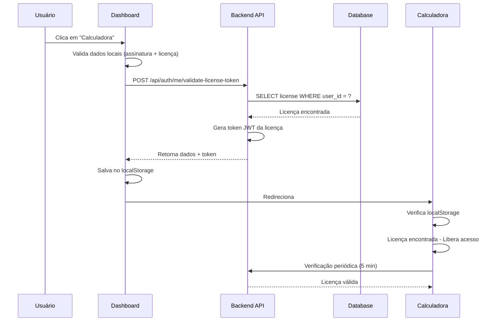

# Licença Exclusiva Vinculada ao Usuário

## Problema Resolvido

**Antes:** Quando o usuário acessava a calculadora pelo dashboard, era solicitado a validar a licença novamente toda vez, mesmo já tendo uma licença ativa vinculada à sua assinatura.

**Agora:** A licença é validada uma única vez e permanece vinculada ao usuário. Só muda quando o plano é alterado.

## Como Funciona

### 1. Backend - Novo Endpoint

**Endpoint:** `POST /api/auth/me/validate-license-token`

**Descrição:**
- Valida a licença do usuário usando seu token de autenticação
- Retorna os dados da licença exclusiva do usuário
- Gera um token JWT da licença para compatibilidade
- Garante que a licença é única e permanente para o usuário

**Requisitos:**
- Header: `Authorization: Bearer <user_token>`

**Resposta de Sucesso:**
```json
{
  "valid": true,
  "key": "FX20251231-IFRS16-ABC123",
  "customer_name": "Nome do Cliente",
  "license_type": "basic",
  "status": "active",
  "expires_at": "2026-01-31T00:00:00",
  "features": {
    "max_contracts": 5,
    "export_excel": true,
    "export_csv": true,
    "support": "email",
    "multi_user": false
  },
  "token": "eyJhbGciOiJIUzI1NiIsInR5cCI6IkpXVCJ9...",
  "message": "Licença válida e vinculada ao usuário"
}
```

**Resposta de Erro:**
```json
{
  "detail": "Nenhuma licença ativa encontrada para este usuário"
}
```

### 2. Frontend - Dashboard

**Função:** `accessCalculator()` (agora async)

**Fluxo:**

1. **Validações iniciais** (lado cliente):
   - Verifica se tem assinatura ativa
   - Verifica se tem licença no dashboard
   - Verifica status da licença e assinatura

2. **Validação no servidor**:
   - Chama `POST /api/auth/me/validate-license-token`
   - Valida a licença vinculada ao usuário
   - Recebe token JWT da licença

3. **Salva dados no localStorage**:
   ```javascript
   localStorage.setItem('ifrs16_license', licenseData.key);
   localStorage.setItem('ifrs16_customer_name', licenseData.customer_name);
   localStorage.setItem('ifrs16_token', licenseData.token); // Token JWT da licença
   localStorage.setItem('ifrs16_user_token', authToken); // Token do usuário
   ```

4. **Redireciona para calculadora**:
   - A calculadora encontra a licença já salva
   - Não solicita validação novamente
   - Usa o token salvo para verificações periódicas

### 3. Novos Casos de Erro no Modal

Adicionados dois novos casos de erro:

**erro_validacao:**
- Título: "Erro na Validação da Licença"
- Mensagem: "Não foi possível validar sua licença. Por favor, tente novamente ou entre em contato com o suporte se o problema persistir."
- Ação: "Entrar em Contato" → mailto:contato@fxstudioai.com

**erro_conexao:**
- Título: "Erro de Conexão"
- Mensagem: "Não foi possível conectar ao servidor. Verifique sua conexão com a internet e tente novamente."
- Ação: "Tentar Novamente" → Recarrega a página

## Vinculação Exclusiva da Licença

### Regras de Negócio

1. **Uma licença por usuário:**
   - Cada usuário tem exatamente UMA licença ativa
   - A licença é criada automaticamente na primeira assinatura
   - Vinculada ao `user_id` no banco de dados

2. **Permanência da licença:**
   - A mesma licença permanece com o usuário
   - Não é necessário revalidar a cada acesso
   - Salva no localStorage do navegador

3. **Mudança de licença:**
   - Ocorre apenas quando o plano muda (upgrade/downgrade)
   - Sistema cancela licença antiga e cria nova
   - Nova licença é automaticamente vinculada ao usuário

4. **Validação contínua:**
   - A calculadora verifica periodicamente se a licença ainda é válida
   - Usa o endpoint `/api/check-license` com o token JWT
   - Se inválida, bloqueia acesso e redireciona para dashboard

## Banco de Dados

### Tabela: `licenses`

```sql
CREATE TABLE licenses (
    id UUID PRIMARY KEY,
    key VARCHAR(100) UNIQUE NOT NULL,
    user_id UUID REFERENCES users(id), -- VINCULAÇÃO EXCLUSIVA
    customer_name VARCHAR(255) NOT NULL,
    license_type VARCHAR(50) NOT NULL,
    status VARCHAR(50) NOT NULL,
    expires_at TIMESTAMP,
    features JSONB,
    revoked BOOLEAN DEFAULT FALSE,
    created_at TIMESTAMP DEFAULT NOW(),
    updated_at TIMESTAMP DEFAULT NOW()
);

-- Índice para busca rápida por usuário
CREATE INDEX idx_licenses_user_id ON licenses(user_id);

-- Garantir apenas uma licença ativa por usuário
CREATE UNIQUE INDEX idx_licenses_user_active
ON licenses(user_id)
WHERE status = 'active' AND revoked = FALSE;
```

## Fluxo Completo



## Segurança

1. **Token JWT:**
   - Contém: key, customer_name, license_type
   - Assinado com JWT_SECRET_KEY
   - Expira conforme configuração do sistema

2. **Validação dupla:**
   - Frontend: Verifica dados no dashboard
   - Backend: Valida licença no banco de dados
   - Token JWT garante integridade

3. **Proteção contra fraude:**
   - Licença vinculada ao user_id (não pode ser transferida)
   - Verificação periódica detecta revogações
   - Índice único impede duplicação

## Testando

### 1. Novo Usuário
```bash
# 1. Criar conta em /register.html
# 2. Fazer assinatura
# 3. Aguardar licença ser criada (automático via webhook)
# 4. Acessar dashboard
# 5. Clicar em "Calculadora" → Deve entrar direto
# 6. Fechar navegador e abrir de novo
# 7. Clicar em "Calculadora" → Deve entrar direto (sem pedir licença)
```

### 2. Mudança de Plano
```bash
# 1. Usuário com plano Basic
# 2. Upgrade para Pro via Portal do Stripe
# 3. Webhook cria nova licença Pro
# 4. Próximo acesso à calculadora: nova licença é carregada automaticamente
```

## Logs

**Console do navegador (sucesso):**
```
✅ Licença validada e salva. Acesso liberado à calculadora.
```

**Console do backend (validação):**
```
[OK] Licença validada para user_id: 123e4567-e89b-12d3-a456-426614174000
```

## Endpoints Relacionados

| Endpoint | Método | Descrição |
|----------|--------|-----------|
| `/api/auth/me/license` | GET | Retorna licença do usuário (dashboard) |
| `/api/auth/me/validate-license-token` | POST | Valida e retorna token da licença (novo) |
| `/api/validate-license` | POST | Valida licença por chave (público) |
| `/api/check-license` | POST | Verifica token JWT da licença |
| `/api/user/subscription` | GET | Dados da assinatura + licença |

## Compatibilidade

✅ **Mantém compatibilidade com:**
- Sistema antigo de validação por chave
- Admins (acesso sem licença)
- Modo offline (usa licença salva)
- Verificação periódica existente

## Deploy

**Backend:** https://ifrs16-backend-1051753255664.us-central1.run.app
**Frontend:** https://fxstudioai.com

**Revisão:**
- Backend: ifrs16-backend-00092-gzw
- Frontend: Firebase Hosting (latest)

---

**Data de Implementação:** 31/12/2025
**Versão:** 1.2.0
